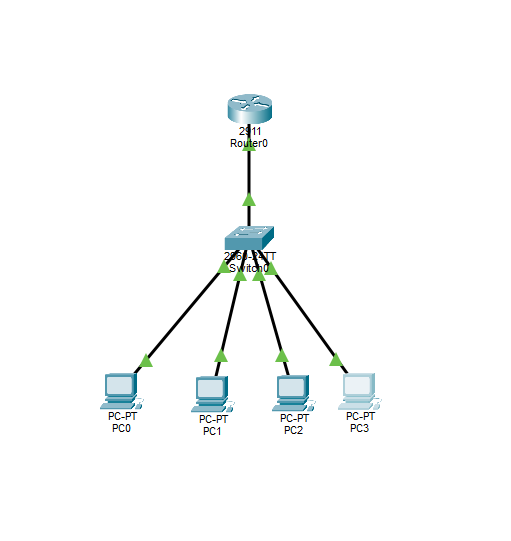
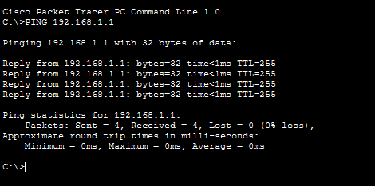

# Small Office Network - Cisco Packet Tracer

Proyecto práctico de red básica empresarial realizado en Cisco Packet Tracer.

## Objetivo

Simular una pequeña red corporativa con conectividad entre dispositivos y asignación automática de direcciones IP mediante DHCP.

## Tecnologías utilizadas

* Cisco Packet Tracer
* Networking
* DHCP
* Routing
* Switching

## Topología

* 1 Router Cisco 2911
* 1 Switch Cisco 2960
* 4 PCs

## Funcionalidades implementadas

* Configuración básica de router
* Configuración de DHCP
* Asignación automática de IPs
* Comunicación entre dispositivos
* Pruebas de conectividad mediante ping

## Conocimientos aplicados

* Troubleshooting básico
* Direccionamiento IP
* Redes LAN
* Configuración de interfaces
* Verificación de conectividad

## Capturas

### Topología

### Prueba de conectividad

## Estado del proyecto

Finalizado y funcional.
